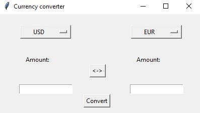

# Currency converter

Currency converter, in order to use it you will need to get your api key from fastforex, after that create a file named 'api_key.txt' and paste the key there. After that you can run the file 'Currency_converter.py' and start using the converter.

